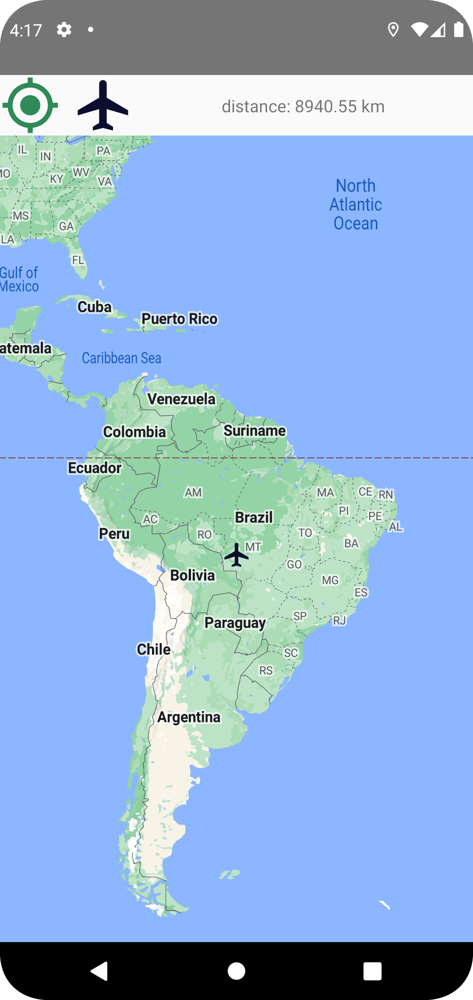
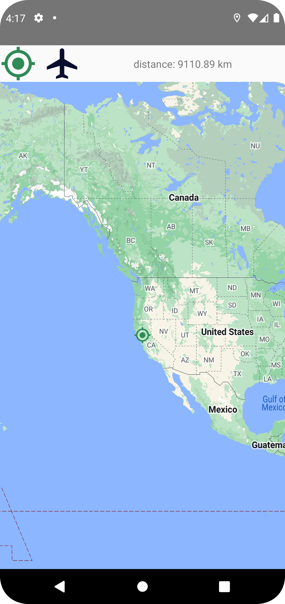

# JP_Morgan_ISS_APP

## A simple Android application to show:
1. Updated ISS Location on the Mape every 5 seconds.
2. Locate the last.
3. User location.
4. Display the distance between the user location and the ISS Location. 
5. Display the crew member on the craft.

## Scenario

the flow of the application using MVVM Architecture, Retrofit, Room 

 1. get the data from the API
 2. store the data in a database
 3. call the API every 5 seconds to get the updated ISS coordinates.
 4. Store in real time the ISS coordinate
 5. Call The Api once to get Craft members
 6. Store in real time the Craft members

## Library references
   1. Retrofit
   2. Dagger Hilt
   3. Room
   4. Coroutine/Flow
   5. Android Maps
   
